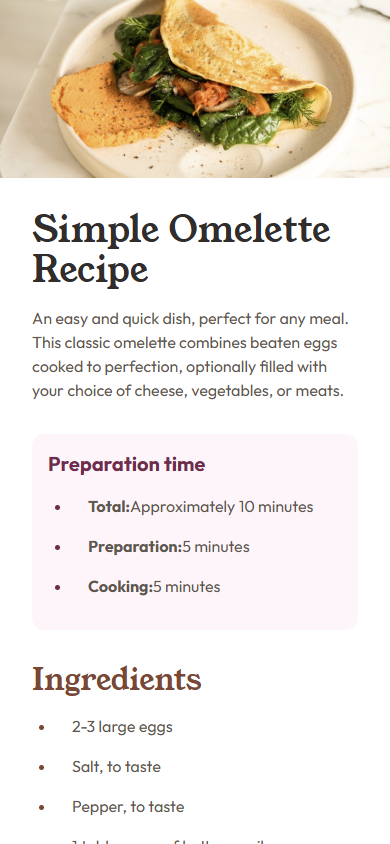

# Frontend Mentor - Recipe page solution

這是一個[Recipe page challenge on Frontend Mentor](https://www.frontendmentor.io/challenges/recipe-page-KiTsR8QQKm)的解決方案，Frontend Mentor challenges可以藉由實際案例幫助你增進你的編碼技能。
This is a solution to the [Recipe page challenge on Frontend Mentor](https://www.frontendmentor.io/challenges/recipe-page-KiTsR8QQKm). Frontend Mentor challenges help you improve your coding skills by building realistic projects. 

## 目錄/Table of contents

- [Frontend Mentor - Recipe page solution](#frontend-mentor---recipe-page-solution)
  - [目錄/Table of contents](#目錄table-of-contents)
  - [概述overview](#概述overview)
    - [截圖screenshot](#截圖screenshot)
    - [Links](#links)
  - [流程/My process](#流程my-process)
    - [使用工具/Built with](#使用工具built-with)
    - [學習紀錄/What I learned](#學習紀錄what-i-learned)

## 概述overview

### 截圖screenshot

### Links

- [solution URL](https://github.com/sora2919/frontendmentorChallenge/tree/main/frontendmentorChallenge/recipe-page-main)
- [live site URL](https://sora2919.github.io/frontendmentorChallenge/frontendmentorChallenge/recipe-page-main-dist/)

## 流程/My process
---
### 使用工具/Built with
- VUE 3
- tailwindcss

### 學習紀錄/What I learned
- tailwindcss的使用、設計RWD更加方便
